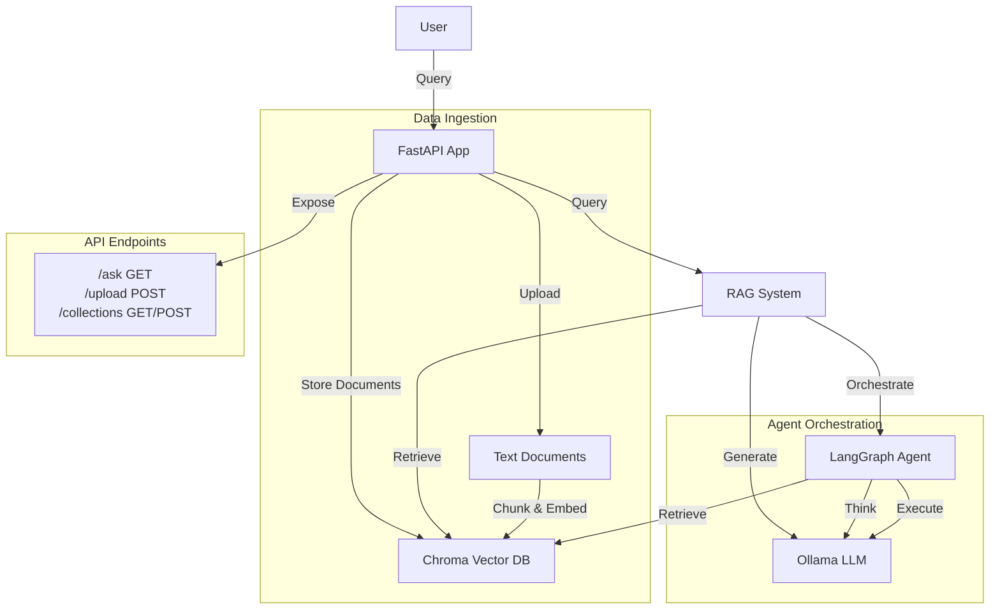

# Architecture Diagram

This diagram illustrates the architecture of our LangGraph RAG system with Ollama LLM integration. The system consists of several key components:

1. **FastAPI Application**: The central component that handles HTTP requests and coordinates the other components.

2. **Data Ingestion**: Handles uploading and processing of text documents (.txt/.md files), which are chunked and embedded into the vector database.

3. **Vector Database**: Chroma DB stores document embeddings and enables semantic search.

4. **LLM Layer**: Ollama provides local LLM capabilities for generating responses.

5. **Agent Orchestration**: LangGraph orchestrates the RAG workflow, managing the state and flow between retrieving, thinking, and executing.

6. **API Endpoints**: Simplified API with only essential endpoints:
   - `/ask`: GET endpoint that returns answers with sources
   - `/upload`: POST endpoint for document ingestion
   - `/collections`: Endpoints for collection management 